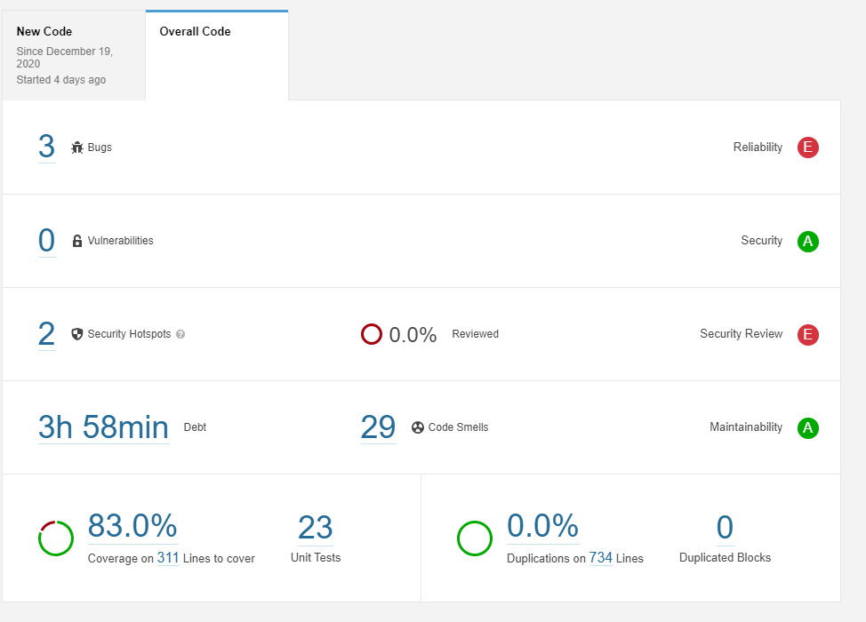
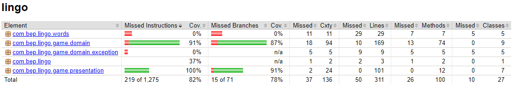

  [](https://codecov.io/gh/ArjanRakke/lingo)

SonarQube static analysis result:



Jacoco branch coverage result:



# lingo
Lingo game for BEP by Arjan Rakké

## Instructions

The lingo app runs via the Heroku app and can be accessed via this link:

```
https://lingo-bep.herokuapp.com/
```

At this moment the lingo app has no GUI so it's not possible to play the game via the browser.
You have to use Postman or a similar tool to play the game.

### Performing requests

To create a game you perform this POST request:
```
POST: https://lingo-bep.herokuapp.com/lingo/game
```

To see a list of all games you created then perform this GET request:
```
GET: https://lingo-bep.herokuapp.com/lingo/games
```

To make a guess on a game perform this POST request together with the response body:
```
POST: https://lingo-bep.herokuapp.com/lingo/guess
Response body JSON: {"game": "gameId", "guess": "yourGuess"}
```

(optional) To register your score perform this POST request together with the response body:
```
POST: https://lingo-bep.herokuapp.com/lingo/registerhighscore
Response body JSON: {"game": "gameId", "player": "playername"}
```

To see the highscores of the players perform this GET request:
```
GET: https://lingo-bep.herokuapp.com/lingo/highscores
```

With the information given above, you should be able to play a full game of Lingo.
